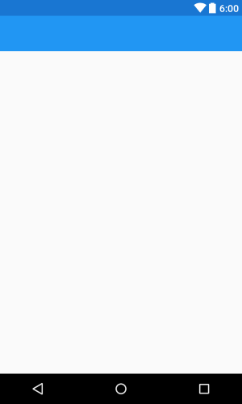
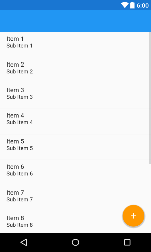
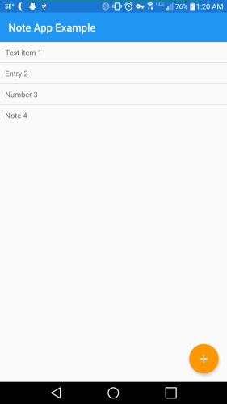

# Note App Example
A tutorial app on building a simple list of notes app.

See below for a self-guided tutorial:

1) Before starting, you will need to download [Android Studio](https://developer.android.com/studio/index.html) and the Android SDK (during the Android Studio installation).
2) Create a new app. Name it whatever you want and set your domain to your website or make something up. Press “Next”. Set the minimum SDK level to 11 and press “Next”. Select “Empty Activity” and press “Next” and then press “Finish”.
3) You are now ready to start making the app.
4) First, we will need to make sure the dependencies are there for what we want to do. The main ones we will be concerned with are appcompat and design. These are included in the app's build.gradle. After editing the file, you should run the gradle sync. If you are on the latest tools, these should be the compile statements:

~~~
dependencies {
    ...
    compile 'com.android.support:appcompat-v7:25.3.1'
    compile 'com.android.support:design:25.3.1'
    ...
}
~~~

5) Next, we are going to define colors. Go to `app>src>main>res>values>colors.xml`. If the file does not exist, create it. 

6) In that file, set the colorPrimary, colorPrimaryDark, and colorAccent. The file should look like this:
~~~~
<?xml version="1.0" encoding="utf-8"?>
<resources>
    <color name="colorPrimary">#2196F3</color>
    <color name="colorPrimaryDark">#1976D2</color>
    <color name="colorAccent">#FF9800</color>
    <color name="white">#FFFFFF</color>
</resources>
~~~~

7) Now we will set up the theme. Go to `app>src>main>res>values>styles.xml`. If the file does not exist, create it. In the file, you will need to customize the styles to match your design and add the “Toolbar” style. You can either make your own or use this:
~~~~
<resources>
    <!-- Base application theme. -->
    

    <!-- Toolbar theme. -->
    
</resources>
~~~~

8) Now we are going to work on the layout of the app. First, right click on the layout folder and add the toolbar layout with "New>Layout resource file". Name it toolbar and click "Ok". In it, define a Toolbar inside an AppBarLayout inside a FrameLayout. The finished code should look like this: 

~~~
<?xml version="1.0" encoding="utf-8"?>
<FrameLayout xmlns:android="http://schemas.android.com/apk/res/android"
    android:layout_width="match_parent"
    android:layout_height="wrap_content">

    <android.support.design.widget.AppBarLayout
        android:id="@+id/bar_layout"
        android:layout_width="match_parent"
        android:layout_height="wrap_content">

        <android.support.v7.widget.Toolbar
            android:id="@+id/toolbar"
            android:layout_width="match_parent"
            android:layout_height="wrap_content"
            android:minHeight="?attr/actionBarSize"
            android:theme="@style/Toolbar" />

    </android.support.design.widget.AppBarLayout>

</FrameLayout>
~~~

9) Go to `app>src>main>res>layout>activity_main.xml`. First thing to do is remove the default padding from the relative layout and include the toolbar. The file should now look like: 
~~~~
<?xml version="1.0" encoding="utf-8"?>
<RelativeLayout xmlns:android="http://schemas.android.com/apk/res/android"
    xmlns:tools="http://schemas.android.com/tools"
    xmlns:app="http://schemas.android.com/apk/res-auto"
    android:id="@+id/activity_main"
    android:layout_width="match_parent"
    android:layout_height="match_parent"
    tools:context="com.alderferstudios.noteappexample.MainActivity">

    <include layout="@layout/toolbar" android:id="@+id/toolbar_layout"/>

</RelativeLayout>
~~~~

10) Next we will add a plus vector asset for the floating action button (FAB). To do this, right click on the “res” folder and choose `New>Vector Asset`. Under “Icon”, click the Android icon and in the next window, scroll up and select the “+” icon. Once that is done, check “Enable auto mirroring for RTL layout” and click “Next” and then “Finish”.

11) Back in the `activity_main.xml`, you will add the ListView to store the items and the floating action button (FAB) to add items to the ListView. Add a ListView below the Toolbar and a FAB in the bottom right corner, offset by the default horizontal and vertical margins. The onClick action for the FAB should be “addItem”, the method that it will execute when clicked. Your code should look like this:
~~~~
<ListView
        android:id="@+id/list"
        android:layout_width="match_parent"
        android:layout_height="wrap_content"
        android:layout_below="@+id/toolbar_layout">
    </ListView>

    <android.support.design.widget.FloatingActionButton
        android:id="@+id/add"
        android:src="@drawable/ic_add_black_24dp"
        android:tint="@color/white"
        app:fabSize="normal"
        app:elevation="4dp"
        android:onClick="addItem"
        android:layout_width="wrap_content"
        android:layout_height="wrap_content"
        android:layout_alignParentBottom="true"
        android:layout_alignParentRight="true"
        android:layout_alignParentEnd="true"
        android:layout_marginRight="16dp"
        android:layout_marginEnd="16dp"
        android:layout_marginBottom="16dp"/>
~~~~

12) Next step is to create a list row layout. It will be a simple LinearLayout with a single TextView. Your code should look like this:
~~~~
<?xml version="1.0" encoding="utf-8"?>
<LinearLayout xmlns:android="http://schemas.android.com/apk/res/android"
    android:layout_width="match_parent"
    android:layout_height="match_parent"
    android:orientation="vertical" >

    <TextView
        android:id="@+id/listText"
        android:layout_width="wrap_content"
        android:layout_height="wrap_content"
        android:padding="10dp"/>

</LinearLayout>
~~~~

13) Now it is time to add functionality to the app. Go to `app>src>main>java>yourappdomain>MainActivity.java`. First create a List of list items, ListView, and ArrayAdapter at the class level. 
~~~~
private List<String> listItems;
private ArrayAdapter<String> adapter;
~~~~

14) Next, under onCreate, you will set the action bar, instantiate the List, and set the adapter like this:
~~~~
setSupportActionBar((Toolbar) findViewById(R.id.toolbar));

listItems = new ArrayList<>();
ListView list = (ListView) findViewById(R.id.list);

// initiate the listadapter
adapter = new ArrayAdapter<>(this,
R.layout.list_row, R.id.listText, listItems);

// assign the list adapter
list.setAdapter(adapter);
~~~~

15) Next you will make the addItem method to add items to the List when you click the FAB. The method must take a View (the calling View) as its parameter. Inside the method, simply add an item to the List of items and notify the adapter that its data set has changed. 
~~~~
public void addItem(View v) {
        listItems.add("Example");
        adapter.notifyDataSetChanged();
    }
~~~~

16) At this point, you should have a working app that adds items to the list when you press the button. However, that is not very useful. Lets add input for note taking. 
17) Now, replace the contents of the addItem method with an AlertDialog that asks for input and adds it to the list. The method should now look like this: 
~~~~
public void addItem(View v) {
        AlertDialog.Builder builder = new AlertDialog.Builder(this);
        builder.setTitle("Please enter the note to add");

        final EditText input = new EditText(this);
        builder.setView(input);

        builder.setPositiveButton("OK", new DialogInterface.OnClickListener() {
            @Override
            public void onClick(DialogInterface dialog, int whichButton) {
                //add the input to the list
                listItems.add(input.getText().toString());
                adapter.notifyDataSetChanged();
            }
        });
        builder.setNegativeButton("CANCEL", null);

        AlertDialog dialog = builder.create();
        dialog.show();

        //show the keyboard when the dialog appears
        try {
            dialog.getWindow().setSoftInputMode(WindowManager.LayoutParams.SOFT_INPUT_STATE_ALWAYS_VISIBLE);
        } catch (NullPointerException e) {
            Log.e("failed to show keyboard", e.getMessage());
        }
    }
~~~~

Congratulations, you now have a working note taking app. This app can take whatever you type in the dialog and save it to the list. Your app should now look something like this:

If you want to save your notes and restore them next time you use the app, continue the tutorial:
18) To save the list, we will use SharedPreferences to save it to the app's cache. First, add the Gson dependency that we will need later: 

~~~
compile 'com.google.code.gson:gson:2.8.0'
~~~

19) Next, add some class level variables to work with SharedPreferences:

~~~
private SharedPreferences prefs;
private SharedPreferences.Editor editor;
~~~

20)  Now we will save the list. SharedPreferences does not allow saving ArrayLists, so there will be some conversion involved using that Gson dependency. Overide onStop and add the code for turning the list into a json string and then use the editor to save it. Your code should look like this:

~~~
@Override
public void onStop() {
    super.onStop();

    //turn list into json
    String items = new Gson().toJson(listItems);

    //save list to cache
    editor.putString("list", items);
    editor.apply(); //use apply, its faster than commit
}
~~~

21) Now that the list is saved, we need to restore it on boot. Within onCreate, add the logic for reading in from SharedPreferences, converting back to an ArrayList, and setting listItems. Your finished onCreate should look like this:

~~~
@Override
protected void onCreate(Bundle savedInstanceState) {
    super.onCreate(savedInstanceState);
    setContentView(R.layout.activity_main);

    setSupportActionBar((Toolbar) findViewById(R.id.toolbar));

    prefs = getPreferences(Context.MODE_PRIVATE);
    editor = prefs.edit();

    //read in saved list
    String savedList = prefs.getString("list", "");
    if (savedList.equals("")) { //nothing saved
        listItems = new ArrayList<>();
    } else {    //restore saved
        Type type = new TypeToken<ArrayList<String>>(){}.getType();
        listItems = new Gson().fromJson(savedList, type);
    }

    ListView list = (ListView) findViewById(R.id.list);

    // adapter to tie listItems to list
    adapter = new ArrayAdapter<>(this,
            R.layout.list_row, R.id.listText, listItems);

    // assign the list adapter
    list.setAdapter(adapter);
}
~~~

At this point, your app should be able to take notes and save and restore them. This is now an app you may actually use.
